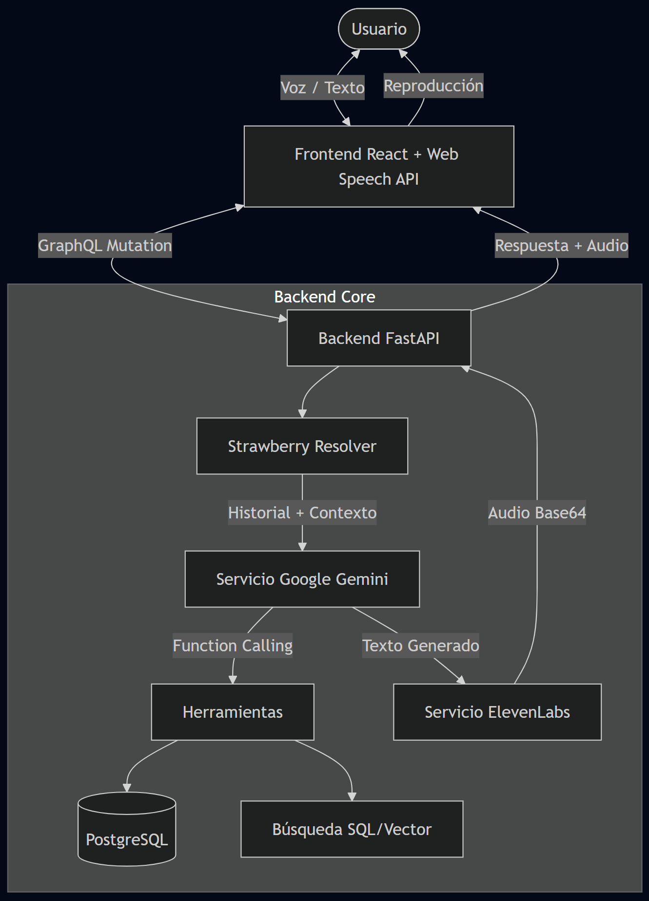

# NovaShop (AgentLM) - Asistente de Ventas con IA y Voz Realista

**NovaShop** es un asistente virtual de vanguardia diseñado para transformar la experiencia de compra en línea. Utilizando el poder de **Google Gemini** para el razonamiento lógico y **ElevenLabs** para una síntesis de voz ultra-realista, NovaShop permite a los usuarios interactuar naturalmente mediante voz o texto para buscar productos, consultar ofertas, gestionar su carrito y realizar compras.

## Tabla de Contenidos
1. [Arquitectura y Flujo](#arquitectura-y-flujo)
2. [Tecnologías Utilizadas](#tecnologías-utilizadas)
3. [Características Principales](#características-principales)
4. [Instalación y Configuración](#instalación-y-configuración)
5. [Estructura del Proyecto](#estructura-del-proyecto)
6. [Conclusiones](#conclusiones)
7. [Autores y Contacto](#autores-y-contacto)

---

## Arquitectura y Flujo

El sistema opera bajo una arquitectura de microservicios simplificada, donde el Frontend se comunica con un API Gateway (FastAPI) a través de **GraphQL**.

### Diagrama del Agente



**Explicación del Flujo:**
1.  **Entrada:** El usuario habla o escribe en la interfaz web.
2.  **Procesamiento:** El frontend envía la solicitud a la API GraphQL.
3.  **Razonamiento:** Gemini recibe el historial y decide qué herramientas usar (buscar precio, añadir al carrito, etc.).
4.  **Acción:** Se ejecutan las herramientas contra la base de datos PostgreSQL.
5.  **Síntesis:** La respuesta de texto de Gemini se envía a **ElevenLabs**, que genera un audio con una voz neural realista (Modelo *Turbo v2.5*).
6.  **Salida:** El usuario recibe la respuesta textual y escucha el audio simultáneamente.

---

## Tecnologías Utilizadas

### Inteligencia Artificial
*   **Google Gemini (Pro/Flash):** Cerebro del agente, manejo de contexto y toma de decisiones.
*   **ElevenLabs API:** Generación de voz (Text-to-Speech) de alta fidelidad y baja latencia.

### Backend
*   **Python 3.10+**
*   **FastAPI:** Framework web de alto rendimiento.
*   **Strawberry GraphQL:** Implementación de API GraphQL basada en clases.
*   **PostgreSQL:** Persistencia de datos (Inventario, Usuarios, Sesiones).
*   **Psycopg2:** Driver de base de datos.

### Frontend
*   **React 18 (Vite):** Biblioteca de UI.
*   **TypeScript:** Para tipado estático y robustez.
*   **CSS Modules / Vanilla CSS:** Estilizado moderno y responsivo.
*   **Web Speech API:** Reconocimiento de voz nativo del navegador (STT).

---

## Características Principales

1.  **Interacción por Voz Realista:**
    *   Integración con **ElevenLabs** para voces naturales y emotivas (masculinas/femeninas).
    *   Reconocimiento de voz fluido desde el navegador.
    
2.  **Gestión Inteligente de Inventario:**
    *   Consultas complejas sobre productos ("¿Qué celulares tienes por menos de $500?").
    *   Comparación de productos automática.

3.  **Carrito de Compras Asistido:**
    *   El agente puede agregar, eliminar y listar productos del carrito autónomamente.
    *   Proceso de checkout simulado.

4.  **Memoria Conversacional:**
    *   Persistencia de conversaciones en PostgreSQL para mantener el contexto entre sesiones.

5.  **Personalidad Adaptativa:**
    *   El agente ajusta su tono según la edad del usuario (detectada en el registro).

---

## Instalación y Configuración

### Prerrequisitos
*   Python 3.10+
*   Node.js 18+
*   PostgreSQL local o remoto.
*   API Keys de **Google Gemini** y **ElevenLabs**.

### 1. Configuración del Backend

1.  Clonar el repositorio y navegar a la carpeta raíz.
2.  Crear y activar entorno virtual:
    ```bash
    python -m venv venv
    .\venv\Scripts\activate  # Windows
    # source venv/bin/activate # Linux/Mac
    ```
3.  Instalar dependencias:
    ```bash
    pip install fastapi uvicorn google-genai python-dotenv psycopg2 requests strawberry-graphql
    ```
4.  Configurar variables de entorno (`.env`):
    ```env
    GEMINI_API_KEY=tu_clave_gemini
    ELEVENLABS_API_KEY=tu_clave_elevenlabs
    DB_HOST=localhost
    DB_NAME=novashop_db
    DB_USER=postgres
    DB_PASSWORD=tu_password
    ```
5.  Inicializar Base de Datos ejecutando los scripts en `db/`.
6.  Iniciar servidor:
    ```bash
    python api.py
    ```

### 2. Configuración del Frontend

1.  Navegar a `frontend/`:
    ```bash
    cd frontend
    ```
2.  Instalar dependencias:
    ```bash
    npm install
    ```
3.  Iniciar aplicación:
### 3. Ejecución
*   El Backend correrá en `http://localhost:8000`
*   El Frontend correrá en `http://localhost:5173`

---

## Estructura del Proyecto

El proyecto está organizado de manera modular para separar la lógica de negocio, la integración con IA y la interfaz de usuario.

```bash
agent_lm/
├── api.py                  # Entry Point. Monta Strawberry GraphQL.
├── graphql_schema.py       # Definición del esquema GraphQL (Query/Mutation).
├── services/               # Lógica de Negocio e Integraciones Externas.
│   ├── gemini_service.py   # Gestión de sesiones y prompt engineering con Gemini.
│   └── elevenlabs_service.py # Servicio de Text-to-Speech.
├── db/                     # Capa de Persistencia.
│   ├── connection.py       # Conexión Singleton a PostgreSQL.
│   ├── cart_ops.py         # Lógica de carritos (SQL puro).
│   ├── user_ops.py         # Gestión de usuarios.
│   └── *.sql               # Scripts de inicialización.
├── tools/                  # Herramientas (Function Calling) para la IA.
│   ├── cart_tools.py       # Wrappers para que la IA maneje el carrito.
│   ├── product_tools.py    # Búsqueda y comparación de productos.
│   └── store_tools.py      # Información estática (horarios, ubicaciones).
├── frontend/               # Single Page Application (React).
│   ├── src/
│   │   ├── lib/            # Cliente API (Fetch/GraphQL).
│   │   ├── ui/             # Componentes React (VoiceChat, ProductCard...).
│   └── ...
└── .env                    # Variables de entorno (API Keys, DB Creds).
```

---

## Uso del Agente

Una vez iniciado el sistema, puedes interactuar con **ShopiBOT** de las siguientes formas:

### Comandos de Voz / Texto Sugeridos
*   **Saludos:** "Hola, ¿quién eres?", "¿Cómo te llamas?"
*   **Búsqueda:** "Estoy buscando un iPhone 15", "¿Tienes celulares Samsung baratos?"
*   **Consultas:** "¿Dónde están los cargadores de celulares?", "¿A qué hora cierran?"
*   **Carrito:** "Agrega el iPhone al carrito", "Muestra mi carrito", "Quiero pagar".
*   **Personalidad:** El agente detectará si eres joven o adulto y ajustará su jerga automáticamente.

### Prompt Engineering Avanzado
El sistema utiliza instrucciones de sistema complejas para:
1.  **Ahorro de Tokens/Créditos:** Instrucciones estrictas para respuestas concisas que ahorran costos en ElevenLabs.
2.  **Protección de Identidad:** El agente nunca revela que es una IA de Google, sino un empleado de NovaShop.
3.  **Manejo de Errores:** Fallbacks automáticos si una herramienta (como la búsqueda de precios) falla.

---

## Conclusiones

Este proyecto demuestra cómo la integración de Modelos de Lenguaje Grande (LLMs) con herramientas externas (Bases de Datos, APIs de Voz) puede crear experiencias de usuario profundamente inmersivas y funcionales. Hemos logrado superar las limitaciones de los chatbots tradicionales (basados en reglas) para ofrecer un asistente que *entiende*, *ejecuta* acciones reales de negocio y *se comunica* de manera casi humana.

La arquitectura modular basada en GraphQL facilita la escalabilidad, permitiendo añadir nuevas herramientas o cambiar proveedores de IA sin reescribir todo el sistema.

---

## Autores y Contacto

**Equipo de Desarrollo:**
*   **Juan David Uzhca** - *Ingeniero Backend & AI Integration* - [juandaviduzhca@hotmail.com](mailto:juandaviduzhca@hotmail.com)
*   **Domenika Sofia Delgado** - *Frontend Developer & UX/UI* - [domenika.delgado@est.ups.edu.ec](mailto:domenika.delgado@est.ups.edu.ec)
*   **Irar Nankamai** - *Database Architect* - [irar.nankamai@est.ups.edu.ec](mailto:irar.nankamai@est.ups.edu.ec)

**GIT HUB:** [AI Shopping Assistant](https://github.com/David5Uzhca/ai_shopping_assistant)

---
*Aplicación desarrollada con fines educativos y demostrativos de Aprendizaje Automático e Inteligencia Artificial (2026).*
